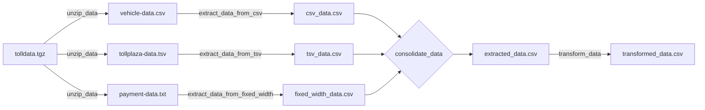
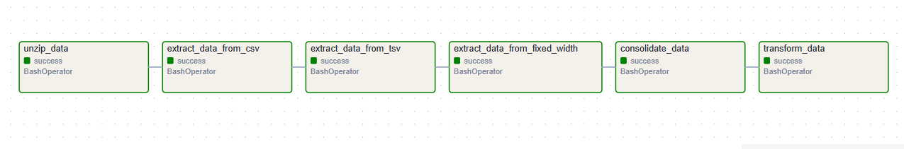
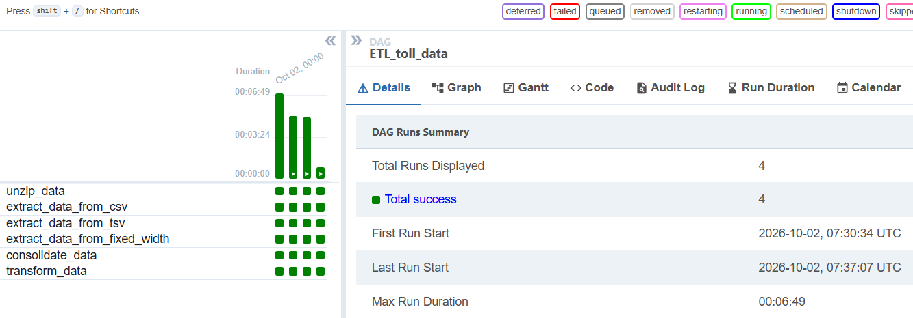
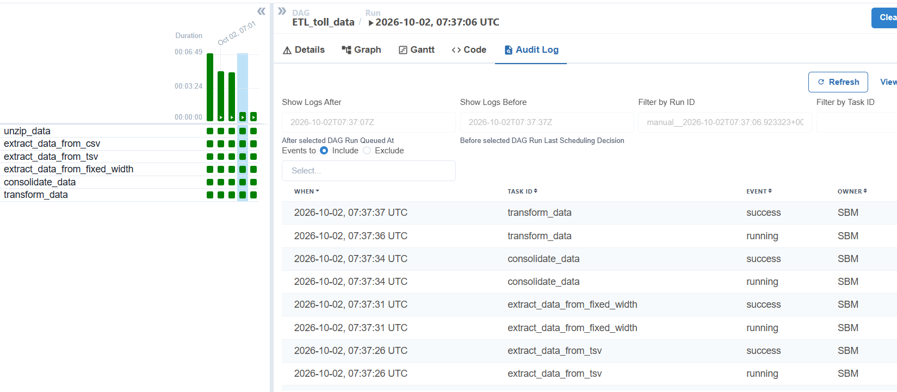
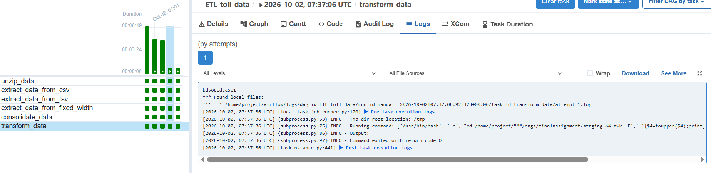
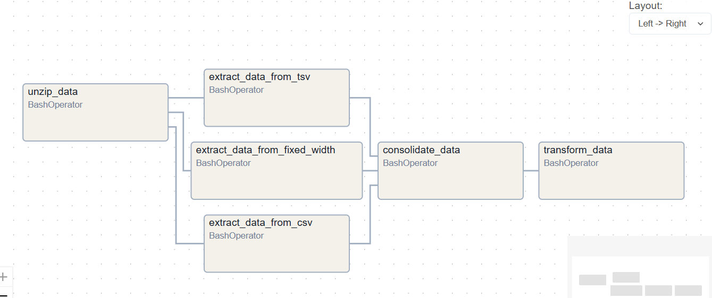
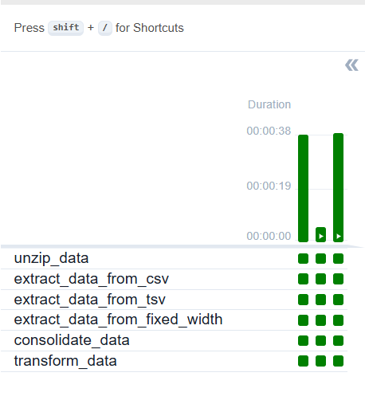
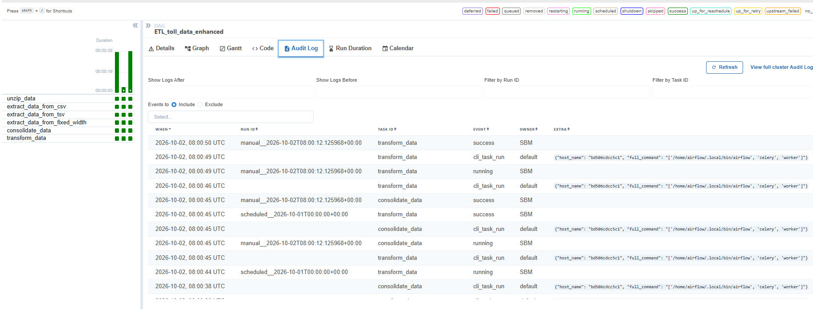
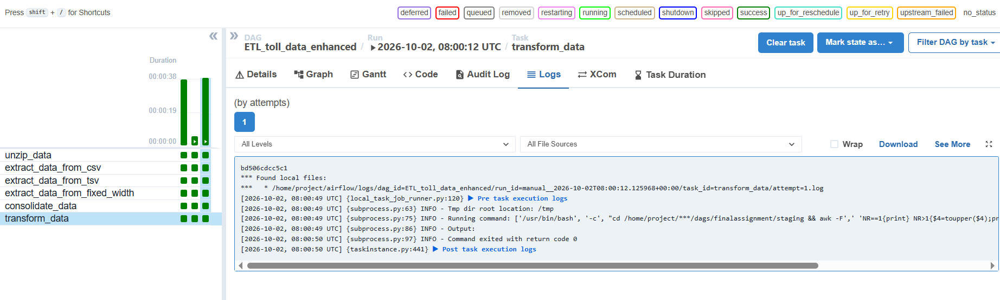

# 🛣️ Toll Data ETL Pipeline with Apache Airflow


An Apache Airflow DAG that collects road traffic data from **three toll operators using three different file formats** (CSV, TSV and fixed-width text), cleans each source, consolidates them into a single CSV file and applies a transformation, ready for downstream traffic analysis.

---

## 📌 Business Scenario

> You are a data engineer at a data analytics consulting company. You have been assigned a project to decongest the national highways by analyzing the road traffic data from different toll plazas. Each highway is operated by a different toll operator with a different IT setup that uses different file formats. Your job is to collect data available in different formats and consolidate it into a single file.

The core challenge is **heterogeneous sources**: every operator exports data differently, with its own delimiter, layout and line-ending conventions. The pipeline normalizes all of them into one consistent, analysis-ready dataset.

---

## 🏗️ Architecture



### Two DAG versions

| | `ETL_toll_data.py` | `ETL_toll_data_enhanced.py` |
|---|---|---|
| Purpose | Course submission (auto-graded) | Portfolio showcase |
| Extraction | Sequential | **Parallel** (fan-out / fan-in) |
| Header row | No | **Yes**, preserved through the transform |
| Dependencies | `a >> b >> c >> ...` | `unzip >> [csv, tsv, fixed] >> consolidate` |
| Run in Airflow | ✅ | ✅ |

---

## 🖥️ Airflow in Action

### Submission DAG — `ETL_toll_data`

**Graph view:** six tasks executed in sequence, all successful



**Run history:** four successful runs



*The first, longer run includes an automatic retry (`retries=1`, 5-minute delay) after a missing-file error was fixed. See [docs/troubleshooting.md](docs/troubleshooting.md).*

**Audit log:** each task starts only after the previous one succeeds



**Task log:** `transform_data` runs from Airflow's temporary directory (`/tmp`), moves into the shared staging folder, and exits with code 0 (`***` is Airflow masking a value it treats as sensitive)



### Enhanced DAG — `ETL_toll_data_enhanced`

**Graph view:** the three extractions run in parallel, then fan back in to `consolidate_data`



**Run history:** all runs successful



**Audit log:** scheduled and manual runs, executed by a Celery worker



**Task log:** the header-aware transform (`NR==1{print} NR>1{$4=toupper($4);print}`) exiting with code 0



---

## 📂 Data Sources

| Operator file | Format | Columns extracted | Cleaning required |
|---|---|---|---|
| `vehicle-data.csv` | Comma-separated | Rowid, Timestamp, Anonymized Vehicle number, Vehicle type | None (no trailing newline in source, normalized by `cut`) |
| `tollplaza-data.tsv` | Tab-separated, Windows line endings (CRLF) | Number of axles, Tollplaza id, Tollplaza code | Tabs → commas, remove `\r` |
| `payment-data.txt` | Fixed-width text | Type of Payment code, Vehicle Code | Extract by character position, space → comma |

More detail on each format, and how it was inspected, in [docs/data-sources.md](docs/data-sources.md).

---

## ⚙️ Pipeline Tasks

| # | Task | Command (core) | Purpose |
|---|---|---|---|
| 1 | `unzip_data` | `tar -xf ../tolldata.tgz` | Extract the three source files into `staging/` |
| 2 | `extract_data_from_csv` | `cut -d ',' -f 1-4` | Select the first four fields |
| 3 | `extract_data_from_tsv` | `cut -f 5-7 \| tr '\t' ',' \| tr -d '\r'` | Select fields, convert delimiter, strip CRLF |
| 4 | `extract_data_from_fixed_width` | `cut -c 59- \| tr ' ' ','` | Select by character position, convert delimiter |
| 5 | `consolidate_data` | `paste -d ','` | Merge the three extracts line by line |
| 6 | `transform_data` | `awk '{$4=toupper($4); print}' OFS=','` | Uppercase the vehicle type, keep all columns |

Every task starts with `cd <staging> &&`, so all tasks share a single working folder (Airflow runs each `BashOperator` in its own temporary directory) and no task runs if the folder is missing.

---

## 📊 Output

`transformed_data.csv`, 10,000 rows × 9 columns (header row included in the enhanced version):

```
Rowid,Timestamp,Anonymized Vehicle number,Vehicle type,Number of axles,Tollplaza id,Tollplaza code,Type of Payment code,Vehicle Code
1,Thu Aug 19 21:54:38 2021,125094,CAR,2,4856,PC7C042B7,PTE,VC965
2,Sat Jul 31 04:09:44 2021,174434,CAR,2,4154,PC2C2EF9E,PTP,VC965
3,Sat Aug 14 17:19:04 2021,8538286,CAR,2,4070,PCEECA8B2,PTE,VC965
```

### Validation results

| Check | Result |
|---|---|
| Row count | 10,000 ✅ (matches every source) |
| Fields per row | 9 in all 10,000 rows ✅ |
| Carriage returns (`\r`) | None ✅ |
| Vehicle type uppercase | All rows ✅ |

| Vehicle type | Records | Share |
|---|---:|---:|
| CAR | 6,438 | 64.4% |
| TRUCK | 2,368 | 23.7% |
| VAN | 1,194 | 11.9% |

**Observation:** the per-type counts match the Vehicle Code counts exactly (`VC965` = 6,438, `VCB43` = 2,368, `VCD2F` = 1,194), which suggests a one-to-one mapping between vehicle code and vehicle type. Payment types are evenly distributed (PTC 3,281 · PTE 3,376 · PTP 3,343).

---

## 🧠 Engineering Challenges Solved

The pipeline was built incrementally: each command was tested and verified in the shell before being wired into Airflow. Highlights:

- **Row-count mismatch (9,999 vs 10,000):** traced with `od -c` to a missing trailing newline in the source CSV. `wc -l` counts newline characters, not rows.
- **Hidden Windows line endings:** `cat -A` revealed `^M` (CRLF) in the TSV, which would have silently corrupted the last column (`PC7C042B7\r`).
- **Fixed-width parsing:** variable-length padding broke space-delimited `cut -f`; switched to character positions (`cut -c`) and verified with `sort | uniq -c` across all rows.
- **Transform one column, keep the rest:** `tr` works on characters, not fields, so `awk` with `OFS` was used to edit field 4 in place.
- **Quoting across two layers:** bash commands inside Python strings; outer double quotes keep tested single-quoted bash code unchanged (and keep awk's `$4` away from bash expansion).
- **Airflow 2 vs 3 compatibility:** the environment had two Airflow installs; a `try/except ImportError` block makes the DAG load on both.
- **Working directories:** relative paths fail in Airflow's per-task temp folders; every task `cd`s into a shared staging folder, guarded by `&&`.

Full write-up with symptoms, diagnosis and fixes: **[docs/troubleshooting.md](docs/troubleshooting.md)**.

---

## 📁 Repository Structure

```
toll-data-etl-airflow/
├── dags/
│   ├── ETL_toll_data.py            # Submission version (sequential, no header)
│   └── ETL_toll_data_enhanced.py   # Portfolio version (parallel extraction + header)
├── scripts/
│   ├── etl_pipeline.sh             # Same pipeline as a standalone Bash script
│   └── validate_output.sh          # Data quality checks on the output file
├── docs/
│   ├── data-sources.md             # Source file formats and how they were inspected
│   └── troubleshooting.md          # Debugging log: symptoms, causes, fixes
├── screenshots/                  # Airflow UI: graph, runs, audit log, task log (both DAGs)
├── .gitignore
├── LICENSE
└── README.md
```

---

## 🚀 How to Run

### Option 1 — Apache Airflow

1. Place `tolldata.tgz` in the folder above `staging/` (by default `/home/project/airflow/dags/finalassignment/`) and create `staging/`:
   ```bash
   mkdir -p /home/project/airflow/dags/finalassignment/staging
   ```
2. Copy a DAG into your Airflow `dags/` folder and confirm it loads:
   ```bash
   cp dags/ETL_toll_data.py dags/ETL_toll_data_enhanced.py $AIRFLOW_HOME/dags/
   airflow dags list-import-errors
   airflow dags list | grep ETL_toll_data     # both DAGs should appear
   ```
3. Unpause and trigger it (a paused DAG keeps triggered runs queued):
   ```bash
   airflow dags unpause ETL_toll_data
   airflow dags trigger ETL_toll_data
   ```
   Or run it once directly in the terminal: `airflow dags test ETL_toll_data` (or `ETL_toll_data_enhanced`).

> Both DAGs write to the same `staging/` folder, so run one at a time if you want to inspect each output.

> Adjust the `STAGING` constant at the top of the DAG if your folder layout differs.

### Option 2 — Standalone Bash (no Airflow)

> If the scripts aren't executable after cloning (files uploaded through GitHub's web interface lose this permission), run `chmod +x scripts/*.sh` once, or call them with `bash scripts/etl_pipeline.sh`.

```bash
./scripts/etl_pipeline.sh /path/to/staging /path/to/tolldata.tgz
WITH_HEADER=true ./scripts/etl_pipeline.sh /path/to/staging /path/to/tolldata.tgz
```

### Validate the output

```bash
./scripts/validate_output.sh /path/to/staging/transformed_data.csv 10000 false   # submission DAG
./scripts/validate_output.sh /path/to/staging/transformed_data.csv 10000 true    # enhanced DAG (header)
```

```
  [PASS] line count = 10000
  [PASS] all rows have 9 fields
  [PASS] no carriage returns (\r)
  [PASS] file ends with newline
  [PASS] vehicle type is uppercase in all data rows
All checks passed.
```

---

## 🛠️ Skills Demonstrated

- **Orchestration:** Apache Airflow DAGs, `BashOperator`, task dependencies (sequential and fan-out/fan-in parallelism), retries, scheduling, version compatibility (2.x / 3.x)
- **Shell data processing:** `cut`, `tr`, `paste`, `awk`, `tar`, pipes, redirection, command grouping
- **Data cleaning:** delimiter normalization, CRLF removal, fixed-width parsing
- **Data quality:** row/field-count validation, profiling with `sort | uniq -c`, byte-level inspection with `cat -A` and `od -c`
- **Debugging:** reading Airflow task logs, diagnosing environment and path issues

---

## 🔮 Possible Improvements

- Success notifications with `on_success_callback` (e.g. `SmtpNotifier`)
- Load `transformed_data.csv` into a database (PostgreSQL / BigQuery) as a final task
- Data quality task inside the DAG (run `validate_output.sh` and fail the run on errors)
- Parameterize paths with Airflow Variables instead of a hard-coded constant

---

## 🎓 Acknowledgments

Final project of the **ETL and Data Pipelines with Shell, Airflow and Kafka** course (IBM, Coursera). Source data provided by IBM Skills Network.

## 👤 Author

**Santiago Burgos**, Electronics Engineer transitioning into Data Engineering

[](https://github.com/SaBuMa)
[](https://www.linkedin.com/in/santiagoburgosm)

## 📄 License

This project is licensed under the MIT License. See [LICENSE](LICENSE).
